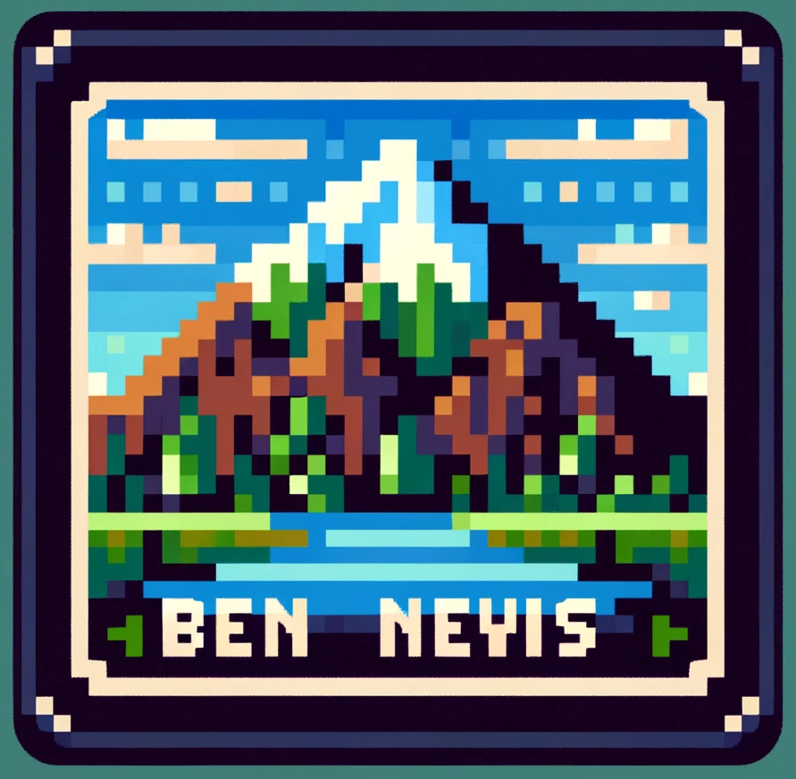

<!--  -->
<div align="center">

</div>


# Introduction

This is an End-to-End (E2E) Automatic Speech Recognition (ASR) toolkit based on Differentiable Weighted Finite-State Transducer (DWFST) with flexible topology definition support, named **BenNevis**, which is essentially implemented with [PyTorch](https://github.com/pytorch/pytorch) and [k2](https://github.com/k2-fsa/k2), where the former serves as the Neural Network backend and the latter for DWFST.

**Note that this project is still under development, so code may be changed rapidly in the near future**

# Features

* Flexible **topology** support
* Kaldi-style data manipulation with [kaldiio](https://github.com/nttcslab-sp/kaldiio) and kaldi scripts
* DWFST backed by [k2](https://github.com/k2-fsa/k2)
* Pure [PyTorch](https://github.com/pytorch/pytorch) implementation
* Distributed Data Parallel (DDP) support with `torch.distributed`
* [WandB](https://wandb.ai/) logger support

# Installation

## Kaldi

You need to install [Kaldi](https://github.com/kaldi-asr/kaldi) first and then run 
```shell
cd BenNevis/tools
./put_kaldi.sh /path/to/kaldi
```
This script simply makes a symbol link to your Kaldi.

In BenNevis, Kaldi is applied for data preparation, feature extraction, graph compilation (based on OpenFST) and WFST-based decoding (`decode-faster` decoder).

## Virtual Environment

You are supposed to create a virtual environment, named `venv`, in `BenNevis/tools/` to run the code in BenNevis.
There are two ways of creating the virtual environment for BenNevis to run.
### Automatic Script

You may simply run
```shell
cd BenNevis/tools
./create_env.sh
```
to create the following environment.
You may notice that the versions of `PyTorch` and `k2` are hard coded in the script.
However, please feel free to change it to your favourite versions.

### Manually Configuration

The automatic script is more recommended, but you may still do it yourself.
```shell
cd BenNevis/tools/
python3 -m venv venv
```
Currently, ``Python >= 3.8`` is recommended.
Actually, you may choose whichever Python version as long as you can successfully install `PyTorch` and `k2`.

From now on, you need to activate this virtual environment and install libraries via `pip`.
Assuming that you are now at `BenNevis/tools/`,
```shell
source venv/bin/activate
```

#### PyTorch
Here is the version that I am using.
Please feel free to use other versions, but at least it should support [`torchrun`](https://pytorch.org/docs/stable/elastic/run.html).
Besides, please make sure that your PyTorch supports CUDA.
```shell
pip install torch==2.1.0 torchvision==0.16.0 torchaudio==2.1.0 --index-url https://download.pytorch.org/whl/cu118
```

#### k2

The `k2` installation is a bit tricky as you need to make sure that the wheel matches your `PyTorch` version, including the `CUDA` version.
For example, 
```Shell
pip install k2==1.24.4.dev20231220+cuda11.8.torch2.1.0 -f https://k2-fsa.github.io/k2/cuda.html
```
You can see that the CUDA and torch version exactly matches what I just installed.
You may refer to [this page](https://k2-fsa.github.io/k2/cuda.html) for more available precompiled wheels.

#### Misc

Here are some other libraries you need to install by pip. Note that some of them are optional.
I do not specify the versions for them but usually the latest versions should work.
```shell
# for the progress bar support
pip install tqdm  
# for configuration management
pip install hydra-core 
# a very powerful logger
pip install wandb 
# for model summary display
pip install torchinfo 
# for kaldi-format data IO
pip install kaldiio 
# for whisper finetuning
pip install openai-whisper

# Currently Optional
pip install transformers
pip install datasets
pip install numba
pip install librosa
pip install soundfile
```

# Quick Start

The best way to start is to look at the YesNo recipe in `egs/yesno/asr/run.sh`, where you can see the basic workflow in BenNevis.

It usually includes

1. Data preparation
2. Feature extraction
3. Training graph preparation (for various topologies)
4. Decoding graph preparation (for various topologies)
5. Training (based on PyTorch Distributed Data Parallel, see `run/train.py` for details)
6. Predicting (obtaining the posterior from the NN model, see `run/predict.sh` for details)
7. Decoding (taking the decoding graph and the posterior as inputs, see `run/decode_faster.sh` for details)
8. Alignment (optional, supporting alignment with ground truth or decoding results, see `run/align.sh` for details)

# Contact

Please feel free to contact me by [email](mailto:zeyuhongwu1995@gmail.com) for any issue about BenNevis.